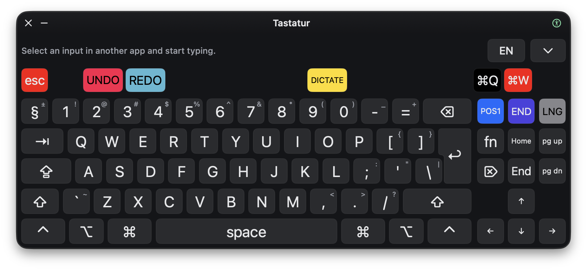

# Tastko

A floating accessibility keyboard for macOS. Type into other apps without taking focus, use custom Panel Editor layouts, and get word suggestions from macOS or Apple Intelligence.



## Install

Requires an Apple Silicon Mac running macOS 27 or later.

1. [Download the latest release](https://github.com/davutac/tastko/releases/latest), open the DMG, and drag Tastko into Applications.
2. Open Tastko and allow it in System Settings → Privacy & Security → Accessibility.
3. Open Panel Editor from Tastko's panel menu, save a keyboard, and reload profiles.
4. Select a text field in another app and click the keys to type.

Apple Intelligence suggestions require Apple Intelligence to be enabled and its model downloaded. macOS suggestions work without it.

## Build

Requires Xcode with the macOS 27 SDK or later. Open `Tastko.xcodeproj`, or run from the repository root:

```sh
./script/build_and_run.sh
```

## Documentation

- [App updates and releases](docs/app-updates.md)
- [Text prediction](docs/text-prediction-performance.md)
- [Login-window keyboard](docs/login-window-keyboard.md)
- [Experimental lock-screen keyboard](docs/lock-screen-display.md)
- [Design system](docs/design-system.md)

Keyboard sounds from [tplai/kbsim](https://github.com/tplai/kbsim), used under the [MIT license](Tastko/Resources/KeyboardSounds/LICENSE-kbsim.txt).
